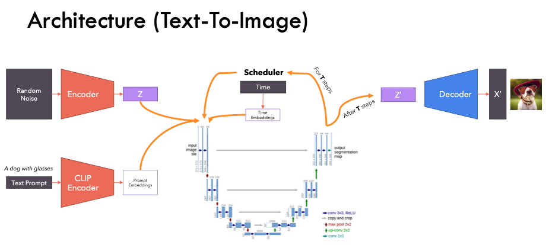
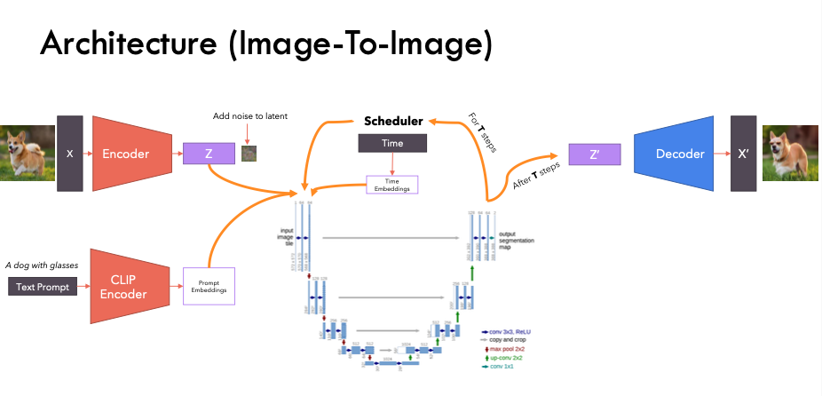
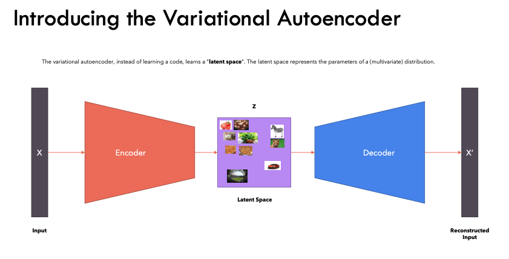
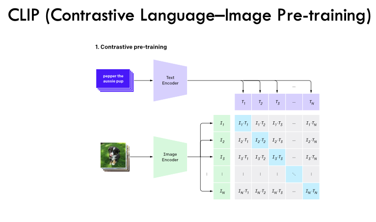
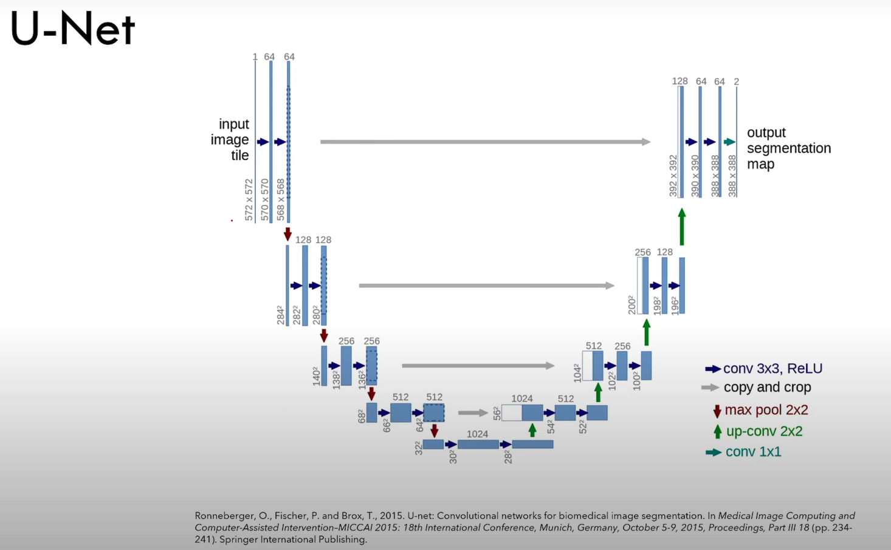

# Stable Diffusion - PyTorch
PyTorch implementation of Stable Diffusion from scratch

Try using `demo.ipynb` to generate images!  
 

## Download Model
Download `v1-5-pruned-emaonly.ckpt` from
[This](https://huggingface.co/runwayml/stable-diffusion-v1-5/tree/main)
and save it in the data folder  
 
 

# Reference

## Paper
- [Stable Diffusion](https://arxiv.org/abs/2112.10752)
- [VAE](https://arxiv.org/abs/1312.6114)
- [CLIP](https://arxiv.org/abs/2103.00020)
- [U-Net](https://arxiv.org/abs/1505.04597)
- [Attention](https://arxiv.org/abs/1706.03762)
- [Self Attention](https://arxiv.org/abs/1812.07860v1)
- [Cross Attention](https://arxiv.org/abs/2103.14899)
- [Classifier Free Guidance](https://arxiv.org/abs/2207.12598)
- [DDPM(Denoising Diffusion Probabilistic Models)](https://arxiv.org/abs/2006.11239)
- (https://arxiv.org/abs/1503.03585)  
 

## Github
- [SouceCode at 'This stable diffusion code'](https://github.com/hkproj/pytorch-stable-diffusion)
- [Initial Stable Diffusion](https://github.com/CompVis/stable-diffusion)
- [CLIP(Contrastive Language–Image Pre-training)](https://github.com/openai/CLIP)  
 

## Appendix

  

- [1] [Diffuion](https://lilianweng.github.io/posts/2021-07-11-diffusion-models/)  
- [2] [Stable Diffusion-1](https://ffighting.net/deep-learning-paper-review/diffusion-model/stable-diffusion/)  
- [3] [stable diffusion-2](https://ai-bloger.tistory.com/96)  
- [4] [VAE](https://process-mining.tistory.com/161)  
  - [4-1] [ELBO(Evidence Lower BOund)](https://modulabs.co.kr/blog/variational-inference-intro/)  
- [5] [CLIP](https://simonezz.tistory.com/88)  
  - [5-1] [ZSL(Zero-Shot Learning)](https://deep-learning-study.tistory.com/873)  
- [6] [U-Net](https://blog.kubwa.co.kr/%EB%85%BC%EB%AC%B8%EB%A6%AC%EB%B7%B0-unet-convolutional-networks-for-biomedical-image-segmentation-2015-unet%EA%B5%AC%ED%98%84-%EC%8B%A4%EC%8A%B5-w-pytorch-40f9e54890d3)  
- [7] [Cross Attention](https://vds.sogang.ac.kr/wp-content/uploads/2023/01/2022%ED%95%98%EA%B3%84%EC%84%B8%EB%AF%B8%EB%82%98_%EC%9C%A0%ED%98%84%EC%9A%B0.pdf)  
  - [7-1] [Attention](https://glee1228.tistory.com/3)  
  - [7-2] [Self Attention](https://ratsgo.github.io/nlpbook/docs/language_model/tr_self_attention/)  

- [8] [Classifier Free Guidance](https://ffighting.net/deep-learning-paper-review/diffusion-model/classifier-free-guidance/)  
- [9] [DDPM-1](https://process-mining.tistory.com/188)  
- [10] [DDPM-2](https://ivdevlog.tistory.com/14)  
- [11] [Diffusion and DDPM Loss Function](https://xoft.tistory.com/33)  
